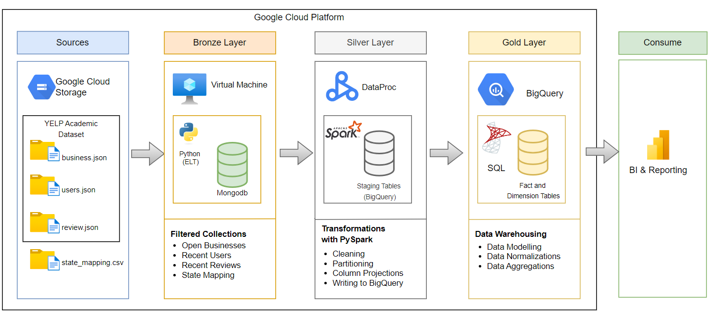
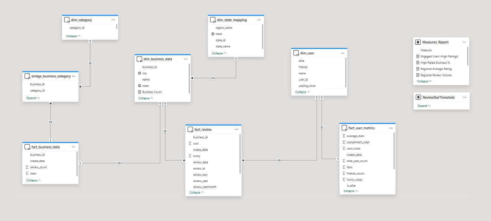
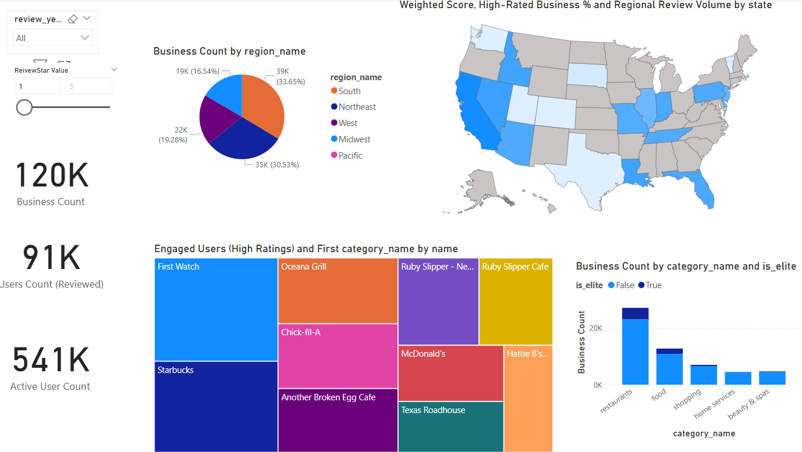

#  Yelp Insights at Scale: A Full-Stack Big Data Architecture on Google Cloud Platform

This project leverages the Yelp Open Dataset to build an end-to-end data pipeline using Google Cloud Platform (GCP). We process raw JSON data with distributed tools and deliver business-ready insights via Power BI dashboards. The goal is to uncover regional patterns, user engagement trends, and category-level performance from millions of business reviews across the U.S.

---

##  Project Highlights

- Ingested semi-structured Yelp JSON files using Python (ELT) into MongoDB (Bronze Layer).
- Cleaned and filtered data using PySpark on GCP Dataproc, and wrote structured outputs to BigQuery (Silver Layer).
- Modeled dimensional and fact tables in BigQuery via SQL (Gold Layer).
- Built dynamic Power BI dashboards with drill-down and slicer interactions.

---

##  Architecture Diagram



---

##  Dataset Description

The dataset used is from the [Yelp Open Dataset](https://business.yelp.com/data/resources/open-dataset/). We also added a custom `state_mapping.csv` for geographic grouping.

| File                      | Description                                                  |
|---------------------------|--------------------------------------------------------------|
| `business.json`           | Business details, category array, star ratings               |
| `review.json`             | Reviews with text, stars, timestamp, user feedback           |
| `user.json`               | User metadata, elite status, review count, friends           |
| `state_mapping.csv`       | Manually added CSV mapping state → region                    |

---

##  Project Structure

```plaintext
├── bronze/
│   └── *.py              # Scripts to load GCS JSON → MongoDB
├── silver/
│   ├── *.py           # PySpark scripts to transform and clean MongoDB → BigQuery
│   └── ...               # Intermediate GCS outputs
├── gold/
│   └── gold_layer.sql    # SQL for dimension/fact tables and views in BigQuery
├── powerbi/
│   ├── Reporting.pbix
│   └── dax_measures.txt  # All DAX measures used in Power BI
├── assets/
│   ├── FinalArchitecture.png
│   ├── PowerBI_DataModelling.png
│   ├── PowerBI_screenshot1.png
│   ├── PowerBI_screenshot2.png
│   └── PowerBI_screenshot3.png
│   └── PowerBI_screenshot4.png
└── README.md            
```
## How to Run

### Step 1: Upload Raw Data

Use the GCS console to upload the following files into the bucket:  
`gs://bucket_name/`

- `yelp_academic_dataset_business.json`
- `yelp_academic_dataset_review.json`
- `yelp_academic_dataset_user.json`
- `data-map-state-abbreviations.csv`

---

### Step 2: Bronze Layer – Load into MongoDB

Run each script under the `bronze/` directory from your GCP VM to populate MongoDB collections:

```bash
python bronze/business_gcstomongodb.py
python bronze/user_gcstomongodb.py
python bronze/review_gcstomongodb.py
python bronze/state_gcstomongodb.py
```


## Step 3: Silver Layer – Clean & Transform

Using **Google Cloud Dataproc** and **PySpark**, this step processes raw data from the Bronze layer and transforms it into cleaned, structured staging data. These are written to **BigQuery staging tables**.

###  Actions:
- Filter **inactive businesses** and **inactive users**
- Join with **state mapping**
- Project only required columns

### How to Submit PySpark Jobs (via GCP Dataproc UI):

1. **Job type**: `PySpark`
2. **Main Python file**:  gs://bucket_name/silver/scripts/state_script.py
3. **Jar files**: (include all required Mongo and BSON drivers)
gs://bucket_name/jars/mongo-spark-connector_2.12-10.1.1.jar
gs://bucket_name/jars/mongodb-driver-core-4.8.0.jar
gs://bucket_name/jars/mongodb-driver-sync-4.8.0.jar
gs://bucket_name/jars/bson-4.8.0.jar

4. **Cluster**: Choose the appropriate active Dataproc cluster under your project and region (e.g., `us-central1`)

5. **Job ID**: Use a descriptive ID (e.g., `job-bqStateTransform`)

6. **Arguments**: Leave blank unless the script requires runtime parameters

7. Click **Submit**.

Repeat the process for:
- `silver/business_script_optimized.py`
- `silver/user_script_optimized.py`
- `silver/review_script.py`

These scripts load MongoDB data, apply transformations, and write output to staging tables in BigQuery (e.g., `silver_layer.business_USStates`, `silver_layer.user_filtered`, etc.).

---

## Step 4: Gold Layer – Dimensional Modeling

This step creates analytical tables in BigQuery using standard SQL.

Run the full SQL script under gold/ to create structured dimension and fact tables:

-- Upload and execute gold/gold_layer_final_script.sql in BigQuery
---

####  Dimension Tables
- `dim_user` – Cleaned and enriched user information
- `dim_business_data` – Structured business metadata
- `dim_category` – Distinct business categories

####  Bridge Table
- `bridge_business_category` – Many-to-many relationship between businesses and categories

####  Fact Tables
- `fact_review` – Review-level metrics with user and business linkage
- `fact_user_metrics` – Aggregated user activity (e.g., review count, average rating)
- `fact_business_data` – Aggregated business performance metrics (e.g., total reviews, avg stars)

####  View
- `vw_business_performance_summary` – Unified view for dashboards and reporting

##  Power BI Dashboard

The Power BI report consumes the **Gold Layer** tables from BigQuery and provides interactive, visual analytics.

###  Features:
- **Slicer-based filtering** on year and star ratings
- **Elite user impact analysis** on reviews and business popularity
- **Regional distribution** of business counts and review patterns
- **Category-level comparisons** with KPIs and treemaps

---

###  Data Modeling Screenshot:


---

###  Steps to Configure Gold Layer Connection:

1. Open the `.pbix` file under powerbi folder in **Power BI Desktop**.
2. Go to **Home > Transform Data > Data Source Settings**.
3. Locate the **BigQuery connection**.
4. Click **Edit Permissions > Edit**.
5. Set the **project ID** and **dataset name** to match your environment (e.g., `sp25-i535-thjaya-yelpanalysis.gold_layer`).
6. Apply changes and **refresh the dataset**.

###  Refresh the Report:
Once configured, click **Refresh** in Power BI to load the latest Gold Layer data from BigQuery into your visuals.


### Sample Report Page:


---


## 🏷 Credits

- **Dataset Source**: [Yelp Open Dataset](https://www.yelp.com/dataset)
- **Project by**: *[theyaneshj17@gmail.com]*

